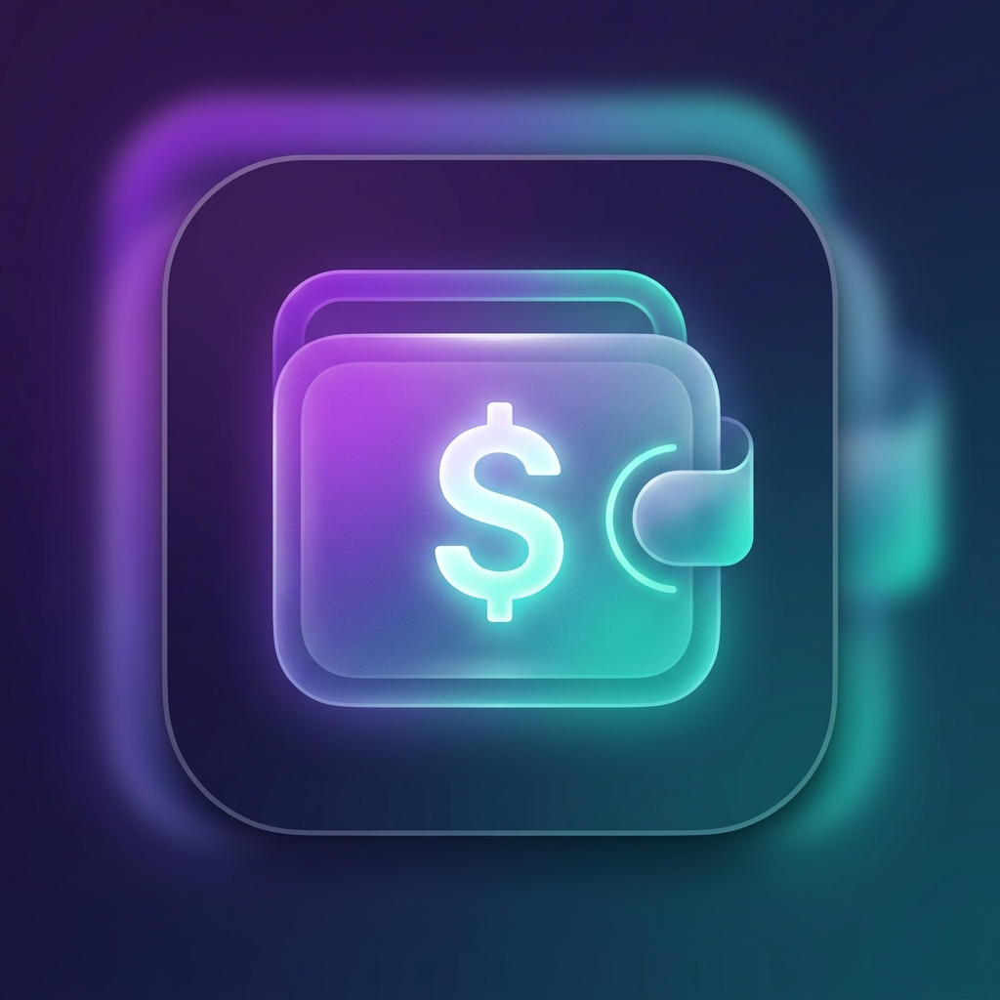

# 📱 SubManager — Smart Subscription Tracker

<p align="center">
  
</p>

<p align="center">
  <strong>Take control of your subscriptions. Track, analyze, and save.</strong>
</p>

<p align="center">
  <a href="#-features">Features</a> •
  <a href="#-tech-stack">Tech Stack</a> •
  <a href="#-architecture">Architecture</a> •
  <a href="#-getting-started">Getting Started</a> •
  <a href="#-privacy">Privacy</a> •
  <a href="#-developer">Developer</a>
</p>

---

## 📌 About

**SubManager** is a premium mobile application built with Flutter that helps users manage and optimize their recurring digital subscriptions. From Netflix to Spotify, cloud storage to gaming — SubManager provides a centralized dashboard with real-time analytics, smart billing alerts, and efficiency scoring to ensure you're getting the most value from every subscription.

---

## ✨ Features

### 🏠 Dashboard
- **Unified View** — See all active subscriptions at a glance with cost, billing cycle, and renewal dates
- **Monthly Spending Summary** — Total monthly expenditure calculated and displayed prominently
- **Quick Actions** — Add, edit, or remove subscriptions with a smooth bottom-sheet UI

### 📊 Analytics & Insights
- **Category Breakdown** — Visual pie/bar charts showing spending across Entertainment, Utility, Music, Productivity, and more
- **Efficiency Scoring** — A smart algorithm that tracks your actual app usage against subscription cost to calculate a value-for-money score
- **Spending Trends** — Track how your subscription costs evolve over time

### 🔔 Smart Notifications
- **Billing Alerts** — Automated push notifications **3 days** and **1 day** before each subscription renewal
- **Toggle Control** — Enable or disable billing alerts from Settings with state persisted across sessions
- **Exact Alarm Scheduling** — Uses Android's exact alarm API for precise, reliable delivery

### 🔐 Account & Security
- **Firebase Authentication** — Secure email/password sign-up and login
- **Change Password** — Update your password securely from within the app
- **Delete Account** — Permanently delete your account and all associated data with password confirmation
- **Cloud Sync** — All subscription data stored and synced via Cloud Firestore

### 🎨 Premium UI/UX
- **Material 3 Design** — Modern design system with custom theming
- **Dark Mode** — Full dark theme support with persistent preference
- **Animated Splash Screen** — Branded launch experience with smooth transitions
- **Glassmorphism Elements** — Subtle frosted-glass effects for a premium feel
- **Micro-Animations** — Smooth transitions and interactive feedback throughout

### 📚 Help & Support
- **FAQ Section** — Comprehensive in-app FAQ with expandable answers
- **Contact Support** — Direct email support integration
- **Privacy Policy** — Full privacy policy accessible in-app and on GitHub

---

## 🛠 Tech Stack

| Layer | Technology |
|-------|-----------|
| **Framework** | [Flutter](https://flutter.dev/) 3.x (Dart) |
| **State Management** | [Riverpod](https://riverpod.dev/) 3.x |
| **Authentication** | [Firebase Auth](https://firebase.google.com/products/auth) |
| **Database** | [Cloud Firestore](https://firebase.google.com/products/firestore) |
| **Notifications** | [flutter_local_notifications](https://pub.dev/packages/flutter_local_notifications) 21.x |
| **Charts** | [fl_chart](https://pub.dev/packages/fl_chart) |
| **Typography** | [Google Fonts](https://pub.dev/packages/google_fonts) |
| **Local Storage** | [SharedPreferences](https://pub.dev/packages/shared_preferences) |
| **Scheduling** | [timezone](https://pub.dev/packages/timezone) |

---

## 🏗 Architecture

The project follows a **feature-first** folder structure with clean separation of concerns:

```
lib/
├── core/                          # Shared theme, providers, utilities
│   ├── theme.dart                 # Material 3 light/dark theme definitions
│   └── providers/
│       ├── theme_provider.dart    # Dark mode toggle with SharedPreferences
│       └── notification_provider.dart  # Billing alerts state & scheduler
│
├── features/
│   ├── auth/                      # Login & Registration screens
│   ├── splash/                    # Animated splash screen
│   ├── dashboard/                 # Main layout & subscription dashboard
│   ├── subscriptions/             # Add/Edit/List subscriptions + providers
│   ├── analytics/                 # Charts & efficiency scoring
│   └── profile/                   # Settings, FAQ, account management
│
├── models/
│   └── subscription.dart          # Subscription data model (Firestore mapping)
│
├── services/
│   ├── firebase_auth_service.dart     # Auth abstraction layer
│   ├── firestore_service.dart         # Firestore CRUD operations
│   ├── notification_service.dart      # Local notification scheduling
│   └── app_usage_service.dart         # Android UsageStats integration
│
├── utils/                         # Helper functions & constants
└── main.dart                      # App entry point & provider setup
```

---

## 🚀 Getting Started

### Prerequisites

- **Flutter SDK** — Latest Stable (3.x)
- **Dart SDK** — ^3.11.1
- **Android Studio** or **VS Code** with Flutter extension
- **Firebase Project** — [Create one here](https://console.firebase.google.com/)

### Installation

1. **Clone the repository**
   ```bash
   git clone https://github.com/Kishan130/sub_manager.git
   cd sub_manager
   ```

2. **Install dependencies**
   ```bash
   flutter pub get
   ```

3. **Firebase Setup**
   - Create a new project on the [Firebase Console](https://console.firebase.google.com/)
   - Enable **Email/Password** authentication
   - Create a **Cloud Firestore** database
   - Register your Android app and download `google-services.json`
   - Place the file in `android/app/google-services.json`

4. **Run the app**
   ```bash
   flutter run
   ```

### Building for Release

```bash
# Generate launcher icons
dart run flutter_launcher_icons

# Generate native splash screen
dart run flutter_native_splash:create

# Build release APK
flutter build apk --release

# Build App Bundle (for Play Store)
flutter build appbundle --release
```

> **Note:** For release builds, create `android/key.properties` with your keystore credentials. See [Flutter deployment docs](https://docs.flutter.dev/deployment/android) for details.

---

## 🔒 Privacy

SubManager takes your privacy seriously:

- **No data selling** — We never sell, trade, or share your personal information
- **Local processing** — App usage analysis happens entirely on your device
- **Secure storage** — All cloud data is encrypted in transit via HTTPS
- **Full control** — Delete your account and all data anytime from Settings

📄 Read our full [Privacy Policy](PRIVACY_POLICY.md)

---

## 📄 License

This project is licensed under the **MIT License** — see the [LICENSE](LICENSE) file for details.

---

## 👨‍💻 Developer

<table>
  <tr>
    <td align="center">
      <a href="https://github.com/Kishan130">
        
        <br />
        <sub><b>Kishan Vachhani</b></sub>
      </a>
      <br />
      <sub>B.Tech Computer Engineering</sub>
      <br />
      <sub>Marwadi University</sub>
    </td>
  </tr>
</table>

---

<p align="center">
  Built with ❤️ using Flutter & Firebase
</p>
